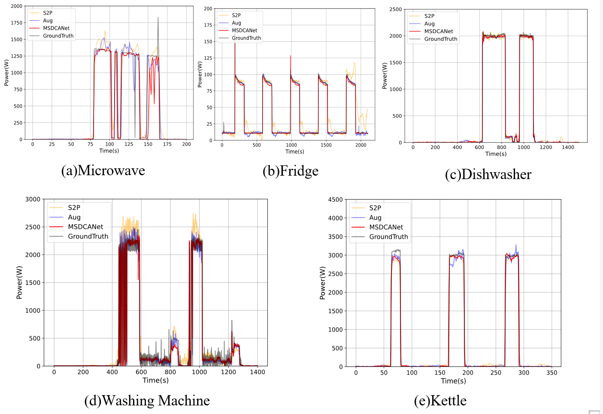

In this repository, there is code available to implement our proposed Multi-Scale Dual-Channel Convolutional Attention Network (MSDCANet) for non-intrusive load monitoring (NILM).

Our work addresses the limitation of mainstream NILM models in capturing single-scale features by employing multi-scale techniques to extract features of varying granularities from load signals. By leveraging a dual-channel architecture, our model(MSDCANe) achieves efficient and effective load disaggregation.

## Requirements:

The code requires conda3 and one CUDA capable GPU，The version of python should preferably be greater than 3.7 our environment(for reference only): 
  tensorflow==2.3.0  
  keras==2.4.0 
  scikit-learn==1.1.2 

## Dataset Preparation for UK_DALE and REDD

We use the UK_Dale low-frequency dataset(1/6Hz) and REDD low-frequency dataset(1Hz &1/3Hz).

1. REDD and UK_DALE datasets are available in (http://redd.csail.mit.edu/) and (https://data.ukedc.rl.ac.uk/browse/edc/efficiency/residential/EnergyConsumption/Domestic/UK-DALE-2015/UK-DALE-disaggregated).
2. Put the raw data into the folder directory dataset_preprocess, and named low_freq and UK_DALE respectively.
3. Run redd_processing.py and uk_dale_processing.py to get the prepared dataset for training and test.
   (note that the preprocessing of UK_DALE dataset needs another step :put the preprocessed data in "dataset_preprocess/created_data/UK_DALE/" )
   The structure of folder directory is as follows:
   dataset_processing/
        created_data/
            REDD/
            UK_DALE/
        low_freq/
            house_1/
            house_2/
            ...
        UK_DALE/
            house_2/
        redd_processing.py
        ukdale_processing.py

## Get the paper results quickly

Some already well-trained models ('*.h5' files) are in the folder directory '/models' 
Change the file path (refer to the parameter 'param_file')  in the MSDCANet_baseline_test.py, and you will get the results soon.
 For example: param_file = args.trained_model_dir + '/UK_DALE'+ '/MSDCANet0_UK_DALE' + args.appliance_name + '_pointnet_model'

## Start the NILM training

You can run MSDCANet_baseline_train.py to verify the results in our paper after you have preprocessed all the dataset.
The best results('*.h5' files) will be stored in the file directory '/models'

## Start the NILM testing

Change the file path (refer to the parameter 'param_file')  in the MSDCANet_baseline_test.py, and you will get the results soon.
    for example: param_file = args.trained_model_dir + '/UK_DALE'+ '/MSDCANet{TrainNum}_UK_DALE' + args.appliance_name + '_pointnet_model'

## Visualization

The visualization of the load decomposition of our model on multiple mainstream appliances is shown below (we compared it with the model with the same decomposition method, and the red one is the decomposition result of MSDCANet):

## Acknowledgement

We appreciate the following github repos a lot for their valuable code base:

https://github.com/linfengYang/AugLPN_NILM   
https://github.com/liuzhuang13/DenseNet    
https://github.com/speechbrain/speechbrain  
https://github.com/emadeldeen24/TSLANet  
https://github.com/mit-han-lab/efficientvit   
https://github.com/MingjunZhong/NeuralNetNilm  
https://github.com/MingjunZhong/transferNILM/  
C. Zhang, M. Zhong, Z. Wang, N. Goddard, and C. Sutton. Sequence-to-point learning with neural networks for non-intrusive load monitoring. In Proceedings for Thirty-Second AAAI Conference on Artificial Intelligence. AAAI Press, 2018.

------

Contact e-mail:miles_gzy@163.com
